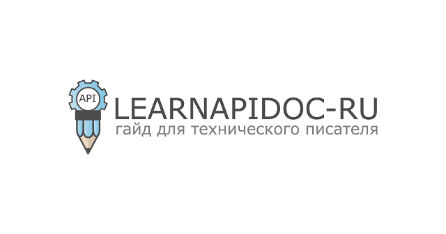

# Курс по документированию API | Learapidoc-ru

Сайт курса https://Starkovden.github.io

Сайт создан при помощи генератора статических сайтов Jekyll при использовании темы [Documentation-theme-jekyll](https://github.com/tomjoht/documentation-theme-jekyll) автора курса Тома Джонсона.

Исходники перевода курса: https://github.com/docops-hq/learnapidoc-ru

Оригинал курса: https://idratherbewriting.com/learnapidoc/

## Коротко о курсе

Тяжелых и скучных лекций об абстрактных понятиях здесь не будет.

Курс по написанию документации REST API подразумевает практический подход к документированию REST API. На этом курсе будем заниматься изучением документации API на примерах использования API сервисов прогноза погоды.

Разберем API на составные части, узнаем о конечных точках, параметрах, типах данных, аутентификации, curl, JSON, командной строке, консоли разработчика Chrome, JavaScript и прочих деталях, связанных с REST API.

Идея курса в следующем: посмотреть на реальные сценарии использования API, сделав этот курс эффективным. Изучать концепты API независимо от контекста мы не будем.

Курс переводится с оригинала по мере поступления материалов, а также при наличии времени у переводчика.

All pull requests are welcome!

<i>Special thanks to <a href="https://www.instagram.com/olyaworkspace/">@Olyaworkspace</a> for the logo<i>

